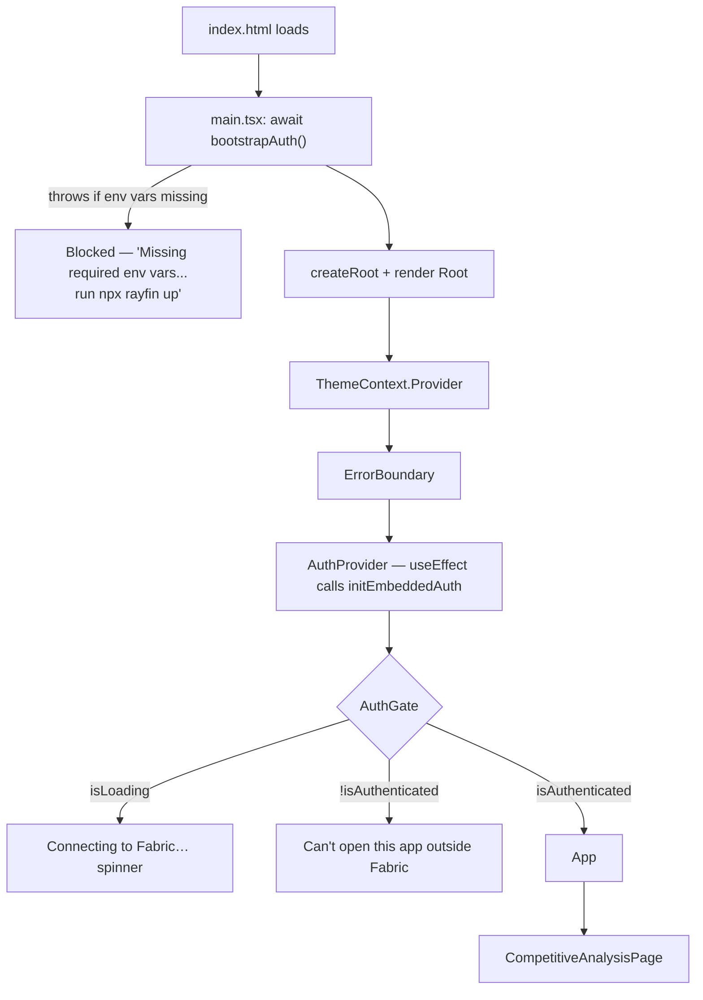
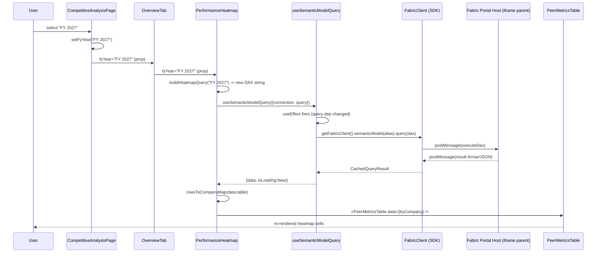
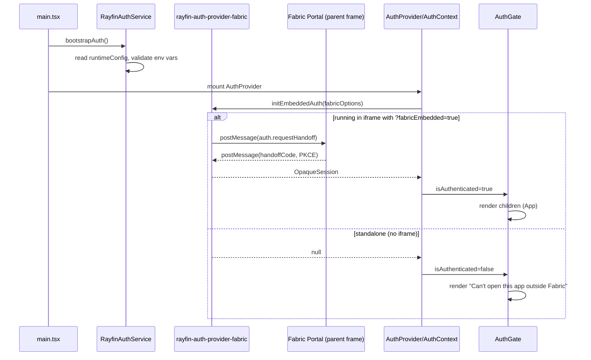
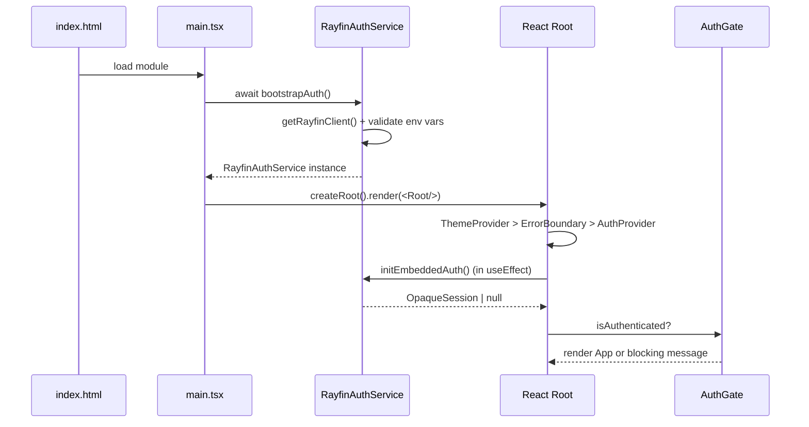
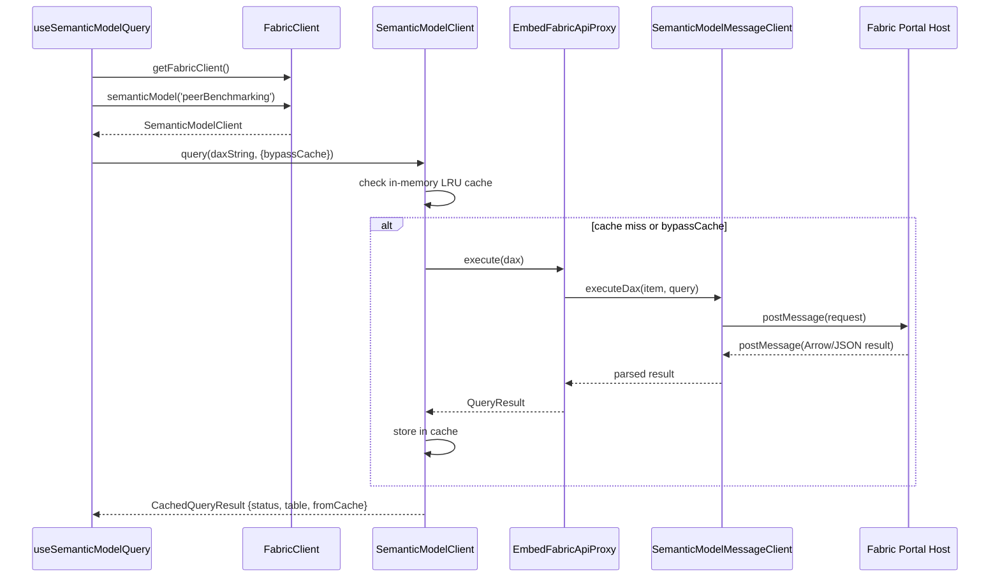
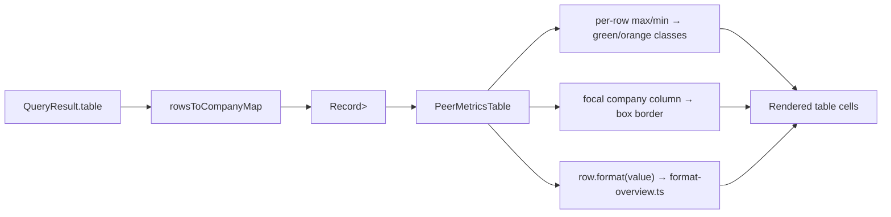

# Architecture Analysis — Peer Benchmarking App

## Executive Summary

**This is not an Express/Node backend application.** There is no `express`, no `app.listen`, no `server.ts`, no controllers, services, repositories, dependency-injection container, or REST/GraphQL API defined anywhere in this repository. A repo-wide grep for `express|app.listen|createServer` returns nothing.

What this actually is: a **client-only Vite + React 19 single-page application** that is loaded inside an `<iframe>` hosted by the Microsoft Fabric portal (a "Fabric Data App" / Rayfin `AppBackend` item). It queries a Power BI/Fabric **semantic model** directly from the browser via the `@microsoft/fabric-app-data` SDK, which sends DAX queries to the Fabric host frame over `window.postMessage` — the host frame owns the Entra ID token and makes the real HTTP call; this codebase never sees a token.

Every section below is grounded in file:line citations gathered by directly reading the source. Where the original request's checklist assumes a backend concept that doesn't exist here (controllers, repositories, MSAL popups, XMLA endpoints), that is stated explicitly rather than invented.

---

## 1. Application Entry Point

| Concern | Answer |
|---|---|
| First file executed | `index.html` → `<script type="module" src="/src/main.tsx">` (`index.html:15-17`) |
| Module-level gate | `src/main.tsx:21` — `await bootstrapAuth()` runs **before** React renders anything |
| React root | `src/main.tsx:39` — `createRoot(document.getElementById('root')!).render(<Root />)` |
| Router | None — the whole app is one page, `App.tsx:16` renders exactly one child |
| DI container | None — plain React function components and hooks, no IoC |

### Provider stack (`src/main.tsx:23-37`, outside → in)

```
ThemeContext.Provider          (src/hooks/theme.context.ts)
 └─ ErrorBoundary               (react-error-boundary, fallback = src/ErrorFallback.tsx)
     └─ AuthProvider            (src/hooks/use-auth.tsx)
         └─ AuthGate            (src/components/auth-gate.component.tsx)
             └─ App             (src/App.tsx)
                 └─ CompetitiveAnalysisPage
```

`App.tsx:11-19` reads `{ isDark, toggleTheme }` from `useThemeContext()` and renders `<CompetitiveAnalysisPage isDark={isDark} toggleTheme={toggleTheme} />` — nothing else.

### package.json scripts (`package.json:14-24`)

```
prebuild      → rayfin env --framework vite        (regenerates .env.local from rayfin/.env)
dev           → rayfin dev                          (Rayfin CLI: local backend + Vite together)
dev:frontend  → vite                                 (Vite only, no Rayfin orchestration)
build         → npx fabric-app-data generate -o src/fabric.generated.ts && tsc -b --noCheck && vite build
build:fabric  → (same as build)
preview       → vite preview
test          → vitest run
```

`fabric.generated.ts` and the `.env.local` Vite variables are **build artifacts**, regenerated from `fabric.yaml` and `rayfin/.env` respectively before every build — nothing in `src/` hand-maintains them.

### Startup flow diagram



---

## 2. End-to-End Request Flow

Since there is no server tier, the "request" for this app is a **DAX query round-trip through the Fabric portal host**, not an HTTP request to a backend of ours.

```
Browser (React component)
  → useSemanticModelQuery() hook          (src/hooks/use-semantic-model-query.ts)
  → getFabricClient().semanticModel(alias).query(dax)   (src/lib/fabric-client.ts)
  → FabricClient / SemanticModelClient     (@microsoft/fabric-app-data, in node_modules — third-party SDK)
  → EmbedFabricApiProxy                    (@microsoft/fabric-app-data-proxy)
  → SemanticModelMessageClient.executeDax()(@microsoft/fabric-app-data-embed-client)
  → window.postMessage → Fabric portal host iframe parent
      [ HOST FRAME, not this repo: holds the Entra token,
        calls the real Power BI/Fabric DAX REST endpoint ]
  ← postMessage response (Arrow/JSON payload)
  → QueryResult parsed by the SDK, cached in FabricClient's in-memory LRU
  → hook's setData(result) → React re-render
  → rowsToCompanyMap() / positional destructuring (src/lib/overview-data.ts)
  → PeerMetricsTable / KpiCard renders formatted values
```

There is no "Backend Controller" or "Service Layer" of ours in this path — those responsibilities are split between the third-party Fabric SDK (client-side, in `node_modules`) and the opaque Fabric-portal host (not in this repo at all).

---

## 3. Semantic Model Connection Analysis

| | |
|---|---|
| **File** | `src/lib/fabric-client.ts` (41 lines, full file read) |
| **Function** | `getFabricClient()` (`:29-41`) |
| **Class(es) instantiated** | `SemanticModelMessageClient` (`:30`), `EmbedFabricApiProxy` (`:33`), `FabricClient` (`:34-37`) |
| **"Connection string"** | None — connection is `{ workspaceId, itemId }` pairs under `fabricConfig.semanticModels.<alias>`, not a connection string |
| **Authentication method** | Embedded iframe + `postMessage` handoff (see §7) — **not** MSAL popup, **not** a service principal, **not** XMLA |
| **Env vars used** | Indirectly: `fabricConfig` comes from `src/fabric.generated.ts`, generated from `fabric.yaml` (not from env vars directly) |

### Connection establishment, step by step

1. `fabric.yaml:1-7` (human-authored) declares the semantic model alias:
   ```yaml
   activeProfile: default
   profiles:
     default:
       semanticModels:
         peerBenchmarking:
           workspaceId: 51b19e59-d8d1-41dd-9b9b-2d401b9d5754
           itemId: 51ebc77c-c773-413f-9689-93ff56cfd5e6
   ```
2. `npx fabric-app-data generate -o src/fabric.generated.ts` (run in `build`/`build:fabric` scripts) turns that into `src/fabric.generated.ts:1-10` — `export const fabricConfig = { semanticModels: { peerBenchmarking: { workspaceId, itemId } } } as const`. Header says "Do not edit."
3. `fabric-client.ts:29-41` — `getFabricClient()`, first call lazily builds and memoizes:
   ```ts
   _messageClient = new SemanticModelMessageClient();              // :30
   const proxy = new EmbedFabricApiProxy(_messageClient);           // :33
   _client = new FabricClient({ proxy, ...fabricConfig });          // :34-37
   ```
4. Every subsequent call returns the same memoized `_client` (`:40`) — one client instance for the whole app lifetime.
5. A caller does `getFabricClient().semanticModel('peerBenchmarking').query(daxString)` — `FabricClient.semanticModel(alias)` looks up the `{workspaceId, itemId}` pair registered under that alias and returns a `SemanticModelClient` bound to it.
6. That `SemanticModelClient.query()` internally calls the `proxy` (`EmbedFabricApiProxy`), whose doc comment (`node_modules/@microsoft/fabric-app-data-proxy/dist/index.d.ts:4-13`) states plainly: *"Delegates DAX query execution to `SemanticModelMessageClient`, which communicates with the Fabric host via `window.postMessage`. The host owns the Entra token and outbound HTTP calls — the embedded app stays free of authentication concerns."*
7. `SemanticModelMessageClient.executeDax(item, query, options)` (its only two public operations are `executeDax`/`executeDaxJson`) performs the actual `postMessage` send/receive round trip to `window.parent` (the Fabric portal).

There is a **second, unrelated** config file that looks similar but serves a different purpose:

- `rayfin/rayfin.yml:1-27` — the broader Rayfin *application* manifest (id `peerb`), controlling `services.auth.fabric.enabled: true`, `allowedRedirectUris` (the local dev ports and deployed `*.webapp.fabricapps.net` origins), `services.staticHosting` (build command, output folder), and confirms `services.data`/`functions`/`storage` are all `enabled: false` — this app has no Rayfin backend services turned on beyond auth + static hosting.
- `rayfin/.env` → regenerated into `.env.local` as `VITE_*` variables (`RAYFIN_PUBLIC_API_URL → VITE_RAYFIN_API_URL`, etc., per `.env.local:4-10`) — these feed `src/lib/rayfin-client.ts`, which is a **separate client from `fabric-client.ts`**, used only for the auth handoff (§7), not for DAX execution.

**No XMLA endpoint, no Analysis Services connection string, no MSAL — none of these exist in this codebase.** The DAX execution transport is entirely `postMessage`-based.

---

## 4. DAX Query Discovery

Two independent generations of DAX exist in this repo:

### (a) Static raw-table dumps — `src/queries/fact-tables/*.dax`

Loaded via Vite's `?raw` import suffix in `src/queries/fact-tables/fact-tables.ts:4-14`. All 11 files are one-line full-table scans, e.g. `income-statement.dax:1` is literally:
```dax
EVALUATE 'Income Statement'
```
Files: `cashflow.dax`, `current-assets.dax`, `current-liabilities.dax`, `enterprise-data-ratios.dax`, `environment.dax`, `income-statement.dax`, `non-current-assets.dax`, `non-current-liabilities.dax`, `return-ratios.dax`, `segmental-revenues.dax`, `social-governance.dax`.

These feed `FACT_TABLES: FactTableConfig[]` (`fact-tables.ts:55-198`) — **but this whole feature is currently dead code**: nothing in the live render tree (`App.tsx` → `CompetitiveAnalysisPage`) imports `FactTableGrid` or iterates `FACT_TABLES`. It's an older raw-table browser, still present, not wired in.

### (b) Dynamically-built parameterized DAX — `src/queries/overview/overview-dax.ts` (129 lines, full file read)

This is what the live "Overview" tab actually uses. Four builder functions, each returning a string with exactly one `EVALUATE` (matching the SDK's documented contract):

| Function | Interpolates | Line |
|---|---|---|
| `buildKpiQuery(fyYear)` | `'Dim Date'[FY Year] = "..."` + hardcoded `'Dim Company'[Company] = "Dr. Reddy's"` | `:32-51`, interpolation at `:48-49` |
| `buildPeerPoolSizesQuery()` | none — static company-count query | `:53-59` |
| `buildHeatmapQuery(fyYear)` | `fyYear` + shared `PEER_FILTER` (Top-10 peer set minus CDMO) | `:62-77`, interpolation at `:74-75` |
| `buildMultiplesQuery(fyYear)` | `fyYear` + `PEER_FILTER` | `:79-92`, interpolation at `:90` |
| `buildConsensusQuery(fyYear, forecastPeriod)` | `fyYear` **and** `forecastPeriod` interpolated directly into measure names, e.g. `[Revenue Growth % (${suffix})]` where `suffix` is `1YF`/`2YF` | `:96-114`, interpolation at `:107-109, :112` |

`daxString()` (`:27-30`) escapes interpolated values by doubling embedded quotes (DAX string-literal escaping). `PEER_ORDER` (`:13-22`) fixes the 8-company display order; `FY_YEAR_OPTIONS`/`DEFAULT_FY_YEAR` (`:117-128`) back the Period dropdown.

### Execution path (identical for both generations)

```
Query string (static .dax or built by overview-dax.ts)
  → useSemanticModelQuery({ connection, query })   (src/hooks/use-semantic-model-query.ts:92-94)
  → getFabricClient().semanticModel(connection).query(query, { bypassCache })
  → SDK: DaxExecutor → EmbedFabricApiProxy → SemanticModelMessageClient.executeDax()
  → postMessage to Fabric host → real DAX execution happens in the Fabric service
  ← Arrow/JSON result parsed into QueryResult, wrapped as CachedQueryResult
```

---

## 5. Data Flow Trace — the "Period" dropdown

```
1. User picks "FY 2027" in the Period <select>
   src/components/overview/competitive-analysis-page.tsx:47-57
        onChange={(e) => setFyYear(e.target.value)}

2. Local state update
   competitive-analysis-page.tsx:29 — useState<string>(DEFAULT_FY_YEAR)

3. Prop drilling (no context/store)
   competitive-analysis-page.tsx:99-100 → <OverviewTab fyYear={fyYear} />
   overview-tab.tsx:9-12 → fans fyYear out to 4 children unchanged:
       <KpiStrip fyYear={fyYear} />
       <PerformanceHeatmap fyYear={fyYear} />
       <MultiplesTable fyYear={fyYear} />
       <ConsensusEstimates fyYear={fyYear} />

4. Each leaf builds its own DAX and calls the hook
   kpi-strip.tsx:31-34            buildKpiQuery(fyYear) + buildPeerPoolSizesQuery()
   performance-heatmap.tsx:22-26  buildHeatmapQuery(fyYear)
   multiples-table.tsx:20-24      buildMultiplesQuery(fyYear)
   consensus-estimates.tsx:26-29  buildConsensusQuery(fyYear, forecastPeriod)
                                  (forecastPeriod is its OWN local useState, :24)

5. Implicit refetch — no explicit onChange→refetch() call anywhere.
   Because buildXQuery(fyYear) returns a NEW string every render, the hook's
   useEffect dependency array (use-semantic-model-query.ts:106,108-110) sees
   a changed `query` and re-runs automatically.

6. Result table → company map
   rowsToCompanyMap(data.table, keys)   src/lib/overview-data.ts:8-22
   (row[0] = company name, row[1..] mapped positionally onto `keys`)

7. Rendered
   PeerMetricsTable                     src/components/overview/peer-metrics-table.tsx:25-110
   - looks up data[company]?.[row.key] per cell (:65)
   - computes row max/min → green/orange highlight classes (:66-72)
   - boxes the first ("focal") company column (:33,53-56,91)
   - formats via format-overview.ts (formatPercentValue / formatRatio / formatIndianNumber)
```



---

## 6. Frontend Rendering Analysis

**State management: none global.** No Redux, Zustand, or MobX in `package.json` dependencies. Every data-fetching component owns its own `data`/`isLoading`/`error` via `useState` inside `useSemanticModelQuery` (`use-semantic-model-query.ts:80-82`) — there is no cross-component cache at the React level. The only shared cache is the SDK's internal in-memory LRU (`FabricClient`'s `QueryCacheStore`), which is a plain library-level cache, not a React store.

Two React Contexts exist, both narrow:
- **Theme** — `src/hooks/theme.context.ts:8-22`, populated by `src/hooks/use-theme.ts:15-61`, which derives `isDark` from the Fabric host's `data-appearance` attribute, a `.dark` class, or `prefers-color-scheme`, watched via `MutationObserver` + `matchMedia`.
- **Auth** — `src/hooks/auth.context.ts:22-32` (see §7).

### Component hierarchy (live tree)

```
App
└─ CompetitiveAnalysisPage        (Period dropdown, tab bar, theme toggle)
   └─ OverviewTab
      ├─ KpiStrip                  → 5 KpiCard
      ├─ PerformanceHeatmap        → PeerMetricsTable
      ├─ MultiplesTable            → PeerMetricsTable
      └─ ConsensusEstimates        → PeerMetricsTable (+ own Forecast Period dropdown)
```

### Data source → transformation → props → rendering, per visual

| Visual | Data source | Transform | Rendering component |
|---|---|---|---|
| KPI cards | `buildKpiQuery` + `buildPeerPoolSizesQuery` | positional destructure of single row (`kpi-strip.tsx:51-63`) | `KpiCard` (`kpi-card.tsx`) |
| Performance Heatmap | `buildHeatmapQuery` | `rowsToCompanyMap` | `PeerMetricsTable` |
| Multiples & Market Cap | `buildMultiplesQuery` | `rowsToCompanyMap` | `PeerMetricsTable` |
| Consensus Estimates | `buildConsensusQuery` | `rowsToCompanyMap` | `PeerMetricsTable` |
| Raw fact tables (dead code) | static `.dax` files | `toDataTable()` (`to-data-table.ts:39-48`) | `DataGrid` (`@microsoft/fabric-datagrid`) inside `FactTableGrid` |

`FactTableGrid` (`src/components/fact-table-grid.tsx`, 177 lines) is the older feature: client-side multi-select filtering, ISO-date normalization (`normalize-cell-value.ts`), then `DataGrid` from the third-party `@microsoft/fabric-datagrid` package. Confirmed unreferenced from the live render tree.

---

## 7. Authentication Flow

**No MSAL. No AAD popup/redirect. No service principal in this repo.** Grep for `msal|MSAL` across `src/` returns nothing.

### Bootstrap sequence

1. `src/main.tsx:21` — `await bootstrapAuth()`, called before React mounts.
2. `bootstrapAuth()` (`src/services/rayfin-auth.service.ts:43-66`):
   - `getRayfinClient()` builds a `RayfinClient` (`src/lib/rayfin-client.ts:16-48`) from `VITE_RAYFIN_API_URL`/`VITE_RAYFIN_PUBLISHABLE_KEY` — throws if missing (`:21-25`).
   - Reads `workspaceId`, `itemId` (as `projectId`), `portalUrl` off `client.runtimeConfig` (`rayfin-auth.service.ts:46-50`).
   - Throws `"Missing required env vars for Fabric auth - run 'npx rayfin up'"` if any are absent (`:52-56`) — since this runs before render, a misconfigured deployment never gets past a blank page.
   - Returns a `RayfinAuthService` wrapping `FabricAuthOptions { workspaceId, projectId, fabricPortalUrl, returnOrigin: window.location.origin }` (`:58-65`).
3. `RayfinAuthService.initEmbeddedAuth()` (`:78-80`) delegates to `initEmbeddedAuth` from `@microsoft/rayfin-auth-provider-fabric`.
4. SDK contract (`node_modules/@microsoft/rayfin-auth-provider-fabric/dist/initEmbeddedAuth.d.ts:1-28`): *"Initializes embedded Fabric authentication if running inside an iframe with `?fabricEmbedded=true`... never opens a popup or new tab... returns `null` immediately"* otherwise.
5. Transport (`PostMessageAuthTransport.d.ts:12-38`): `requestHandoff()` sends a `fabric-auth`/`auth.requestHandoff` `postMessage` to `window.parent`, correlates a response carrying a PKCE `handoffCode`, via `sendBridgeRequest` from `@microsoft/fabric-embedded-host`.

### Provider / gate

- `AuthProvider` (`src/hooks/use-auth.tsx:32-75`) calls `initEmbeddedAuth()` once in `useEffect` (`:40-60`), stores `OpaqueSession | null` in `useState`, exposes `{ session, isAuthenticated, isLoading, error }` via context (`:64-74`). Doc comment: *"When loaded standalone, `initEmbeddedAuth` returns `null` immediately."*
- `AuthGate` (`src/components/auth-gate.component.tsx:16-46`) renders a "Connecting to Fabric…" spinner while loading, "Can't open this app outside Fabric" if not authenticated, else `children`.

### Important distinction: this auth path is separate from DAX auth

The Rayfin-session handoff above (`AuthContext`/`RayfinAuthService`) is **not** what authenticates DAX queries. `getFabricClient()` (§3) builds its own independent `SemanticModelMessageClient`/`EmbedFabricApiProxy` pair. Both mechanisms rely on the same underlying fact — the app is embedded in a Fabric-portal iframe — but they are two separate `postMessage` channels serving two separate purposes (app-level session vs. per-query DAX execution). The host frame is the only place an Entra token ever exists.



---

## 8. API Layer Mapping

**No equivalent.** This repo defines no routes, controllers, services, or repositories. The closest analogue table, mapping the *actual* layers involved:

| "Route" (query builder) | "Controller" (component) | "Service" (hook) | External dependency |
|---|---|---|---|
| `buildKpiQuery` / `buildPeerPoolSizesQuery` | `KpiStrip` | `useSemanticModelQuery` | Fabric semantic model (via postMessage) |
| `buildHeatmapQuery` | `PerformanceHeatmap` | `useSemanticModelQuery` | Fabric semantic model |
| `buildMultiplesQuery` | `MultiplesTable` | `useSemanticModelQuery` | Fabric semantic model |
| `buildConsensusQuery` | `ConsensusEstimates` | `useSemanticModelQuery` | Fabric semantic model |
| static `.dax` files | `FactTableGrid` (dead code) | `useSemanticModelQuery` | Fabric semantic model |
| — | `AuthProvider` | `RayfinAuthService.initEmbeddedAuth` | Fabric portal host (session handoff) |

Everything past "External dependency" (the actual DAX execution engine, the Entra token, the Power BI REST call) lives inside the Fabric portal host process and the Fabric backend service — outside this repository entirely.

---

## 9. Dependency Graph

```
CompetitiveAnalysisPage
  ↓
OverviewTab
  ↓
KpiStrip / PerformanceHeatmap / MultiplesTable / ConsensusEstimates
  ↓
overview-dax.ts (buildXQuery functions)
  ↓
useSemanticModelQuery (hook)
  ↓
fabric-client.ts → getFabricClient()
  ↓
FabricClient.semanticModel(alias).query(dax)      [@microsoft/fabric-app-data]
  ↓
EmbedFabricApiProxy                                [@microsoft/fabric-app-data-proxy]
  ↓
SemanticModelMessageClient.executeDax()            [@microsoft/fabric-app-data-embed-client]
  ↓
window.postMessage
  ↓
Fabric Portal Host (separate process/origin — not in this repo)
  ↓
Power BI / Fabric semantic model service (executes the real DAX)
```

Parallel, independent graph for app-level auth:

```
main.tsx → bootstrapAuth() → RayfinAuthService → initEmbeddedAuth()  [@microsoft/rayfin-auth-provider-fabric]
  ↓
PostMessageAuthTransport → window.parent (Fabric Portal Host)
  ↓
AuthContext (session) → AuthGate → renders App or blocks it
```

---

## 10. Folder Structure Explanation

- **`components/`** — presentational React components. `overview/` holds the live dashboard (Overview tab and its four widgets); `ui/` holds generic primitives (`badge`, `button`, `checkbox`, `popover`); `fact-table-grid.tsx` and `multi-select-filter.tsx` sit at the top level because they belong to the older raw-table-browser feature, currently unreferenced from the live tree.
- **`hooks/`** — cross-cutting React state: auth (`auth.context.ts`, `use-auth.tsx`), theme (`theme.context.ts`, `use-theme.ts`), and the single data-fetching hook (`use-semantic-model-query.ts`).
- **`lib/`** — framework-agnostic helpers: the two SDK client singletons (`fabric-client.ts` for DAX, `rayfin-client.ts` for the auth handoff config), data-shaping (`overview-data.ts`, `to-data-table.ts`, `fact-table-metadata.ts`, `normalize-cell-value.ts`), display formatting (`format-overview.ts`), and `cn()`-style class utilities (`utils.ts`).
- **`queries/`** — all DAX source, split into `fact-tables/` (static one-line table dumps) and `overview/` (parameterized query builders). `index.ts` barrels re-export each.
- **`services/`** — the one non-React service class, `rayfin-auth.service.ts`, invoked once at bootstrap.
- **`test/`** — Vitest/RTL global setup.
- **Root files** (`App.tsx`, `main.tsx`, `ErrorFallback.tsx`, `global.css`, `vite-env.d.ts`, `fabric.generated.ts`) — SPA bootstrap and generated config, as described in §1–§3.

**Explicitly absent, by design** (not oversights): `controllers/`, `routes/`, `middleware/` (aside from one dev-only Vite CORS shim in `vite.config.ts:25-49` needed for Chromium's Local Network Access checks when the Fabric-portal origin embeds `localhost`), `models/`/ORM, `repositories/`, server-side session storage. These concerns are handled either client-side in the files above, or inside the opaque Fabric-portal host / Rayfin backend that this SPA only reaches via `postMessage` — none of which is code in this repository.

---

## 11. Critical Files (ranked)

| # | File | Purpose | Consumers | Execution frequency |
|---|---|---|---|---|
| 1 | `src/lib/fabric-client.ts` | Builds/memoizes the one `FabricClient` singleton | Every query-issuing component | Once (lazy singleton), read on every query |
| 2 | `src/hooks/use-semantic-model-query.ts` | The single data-fetching hook wrapping the SDK | 5 components (`KpiStrip`, `PerformanceHeatmap`, `MultiplesTable`, `ConsensusEstimates`, `FactTableGrid`) | Every render where `query`/`connection` changes |
| 3 | `src/queries/overview/overview-dax.ts` | All parameterized DAX generation for the live tab | 4 overview components | Every Period/Forecast-Period change |
| 4 | `src/components/overview/competitive-analysis-page.tsx` | Owns `fyYear`/`activeTab` state, top-level page shell | `App.tsx` | Once per session; re-renders on dropdown change |
| 5 | `src/components/overview/peer-metrics-table.tsx` | Shared table renderer + heatmap highlight logic | 3 overview widgets | Every data refresh |
| 6 | `src/lib/overview-data.ts` | `rowsToCompanyMap` — query result → UI-ready map | 3 overview widgets | Every query result |
| 7 | `src/services/rayfin-auth.service.ts` | App-level Fabric session bootstrap | `main.tsx` | Once at startup |
| 8 | `src/hooks/use-auth.tsx` + `auth.context.ts` | Auth session context/gate | `main.tsx`, `AuthGate` | Once at startup |
| 9 | `src/components/auth-gate.component.tsx` | Blocks rendering until authenticated | `main.tsx` | Once at startup |
| 10 | `fabric.yaml` | Human-authored semantic-model workspace/item IDs | `fabric-app-data generate` (build-time) | Build time only |
| 11 | `src/fabric.generated.ts` | Generated runtime config consumed by `fabric-client.ts` | `fabric-client.ts` | Every `getFabricClient()` call |
| 12 | `rayfin/rayfin.yml` | Rayfin app manifest: auth/services/static-hosting config | `rayfin` CLI (deploy/dev) | Deploy/dev time |
| 13 | `vite.config.ts` | Dev server port pinning, CORS shim, build guard, aliasing | Vite tooling | Build/dev time |
| 14 | `src/components/overview/kpi-strip.tsx` | KPI strip: 2 queries + positional destructure | `overview-tab.tsx` | Every Period change |
| 15 | `src/components/overview/consensus-estimates.tsx` | Consensus table + its own Forecast Period state | `overview-tab.tsx` | Every Period/Forecast change |
| 16 | `src/lib/format-overview.ts` | All numeric/percent/currency formatting | `peer-metrics-table.tsx`, `kpi-strip.tsx` | Every render |
| 17 | `src/lib/rayfin-client.ts` | Builds the `RayfinClient` used for auth config resolution | `rayfin-auth.service.ts` | Once at startup |
| 18 | `src/hooks/use-theme.ts` + `theme.context.ts` | Host-driven dark/light theme sync | `App.tsx`, all styled components | On host theme change |
| 19 | `src/components/fact-table-grid.tsx` | Older raw-table browser (dead code, still present) | none currently | N/A — unreferenced |
| 20 | `src/queries/fact-tables/fact-tables.ts` | Static `.dax` table configs (dead code) | `fact-table-grid.tsx` (unreferenced) | N/A |

---

## 12. Runtime Sequence Diagrams

### Application Startup



### User Query Execution (Period change)

*(See §5 for the full diagram — reproduced there.)*

### Semantic Model Query Execution (SDK internals)



### UI Rendering Flow



---

## 13. Findings Summary

1. **Where does execution start?** `index.html` → `src/main.tsx:21` (`await bootstrapAuth()`) → `src/main.tsx:39` (React root render) → `src/App.tsx:16` (`CompetitiveAnalysisPage`).
2. **Where is semantic model connection established?** `src/lib/fabric-client.ts:29-41`, `getFabricClient()` — builds `SemanticModelMessageClient` → `EmbedFabricApiProxy` → `FabricClient`, configured from `src/fabric.generated.ts` (itself generated from `fabric.yaml`).
3. **Where is authentication performed?** Two independent flows, both `postMessage`-based, neither MSAL: (a) app-level session — `src/services/rayfin-auth.service.ts` + `@microsoft/rayfin-auth-provider-fabric`'s `initEmbeddedAuth`; (b) per-query DAX auth — implicitly handled by `SemanticModelMessageClient`/`EmbedFabricApiProxy`, which never touches a token at all (the Fabric host does).
4. **Where are DAX queries created?** Two places: static one-liners in `src/queries/fact-tables/*.dax` (dead code path) and dynamically-built strings in `src/queries/overview/overview-dax.ts` (live path, `buildKpiQuery`/`buildHeatmapQuery`/`buildMultiplesQuery`/`buildConsensusQuery`).
5. **Where are DAX queries executed?** Never in this repo's own code — `useSemanticModelQuery` (`src/hooks/use-semantic-model-query.ts:92-94`) hands the string to the third-party SDK, which relays it via `postMessage` to the Fabric portal host, which is the only place that actually executes DAX against the Power BI service.
6. **Where are results transformed?** `src/lib/overview-data.ts` (`rowsToCompanyMap`) for the live dashboard; `src/lib/to-data-table.ts` (`toDataTable`) for the older raw-table browser; formatting in `src/lib/format-overview.ts`.
7. **Where are results rendered in UI?** `src/components/overview/peer-metrics-table.tsx` (shared table + heatmap highlighting) and `src/components/overview/kpi-card.tsx` (KPI strip), composed by `src/components/overview/overview-tab.tsx` under `src/components/overview/competitive-analysis-page.tsx`.
8. **What are the most critical files to understand first?** In order: `fabric-client.ts` → `use-semantic-model-query.ts` → `overview-dax.ts` → `competitive-analysis-page.tsx` → `peer-metrics-table.tsx` → `overview-data.ts` → `rayfin-auth.service.ts`/`use-auth.tsx`.

**Bottom line:** this is a thin, entirely client-side dashboard. The interesting architecture is not a request pipeline through layered backend tiers — it's the double `postMessage` bridge (one for app auth, one for DAX execution) that lets a sandboxed iframe safely query a Power BI semantic model without ever holding a credential itself, plus a simple prop-drilled state model (one `fyYear`, no global store) driving four independent per-widget data fetches.
